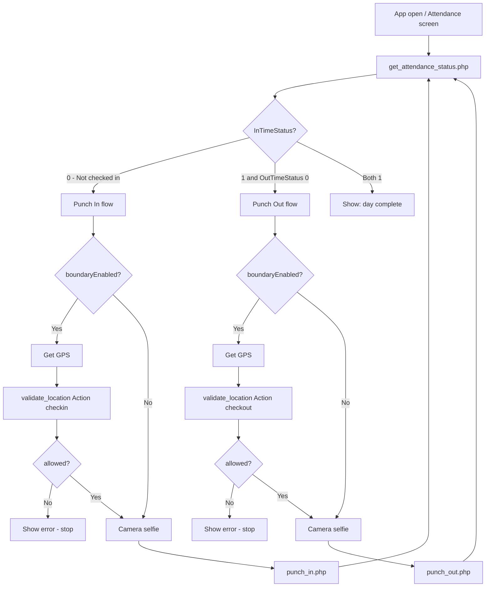

# Mobile App — API Call Sequence (Punch In / Punch Out)

**Base URL:** `https://techxpertindia.in/api/employeenewapi/`

**Method:** `POST` · **Header:** `Content-Type: application/json` · **Body:** JSON

For full request/response examples see [EMPLOYEE_NEW_ATTENDANCE_API.md](./EMPLOYEE_NEW_ATTENDANCE_API.md).

---

## Location rules (remember)

| Action | Where employee must be (if `boundaryEnabled = true`) |
|--------|------------------------------------------------------|
| **Punch in** | Assigned **employee location only** |
| **Punch out** | **Employee location** OR **any active branch** |

If `boundaryEnabled = false`, skip GPS validation steps (still send lat/long on punch if you have them).

---

## Quick reference — call order

### When app opens (every time)

| Step | API | Required? |
|------|-----|-----------|
| 1 | `get_attendance_status.php` | **Yes** |

### Punch in (check-in)

| Step | API | Required? |
|------|-----|-----------|
| 1 | `get_attendance_status.php` | **Yes** (if not already loaded) |
| 2 | `validate_location.php` | **Yes** if `boundaryEnabled = true` |
| 3 | `punch_in.php` | **Yes** |

### Punch out (check-out)

| Step | API | Required? |
|------|-----|-----------|
| 1 | `get_attendance_status.php` | **Yes** (if not already loaded) |
| 2 | `get_checkout_eligibility.php` | Optional (recommended) |
| 3 | `validate_location.php` | **Yes** if `boundaryEnabled = true` |
| 4 | `punch_out.php` | **Yes** |

### Optional (any time)

| API | When to use |
|-----|-------------|
| `get_location_policy.php` | Only need policy, not full status |
| `get_branch_attendance_locations.php` | Show branch map for **check-out** |

---

## Flow diagram



---

## 1. App open — always call first

### API 1: `get_attendance_status.php`

**URL:** `POST /api/employeenewapi/get_attendance_status.php`

```json
{
  "EmployeeID": 123
}
```

**Use the response to decide UI:**

| Field | Value | What to show |
|-------|-------|--------------|
| `InTimeStatus` | `0` | Show **Punch In** button |
| `InTimeStatus` | `1` and `OutTimeStatus` | `0` | Show **Punch Out** button |
| `InTimeStatus` | `1` and `OutTimeStatus` | `1` | Show "Attendance complete for today" |

**Save for later steps:**

```json
"data": {
  "location_policy": {
    "boundaryEnabled": true,
    "checkinLocationRule": "employee_only",
    "checkoutLocationRule": "employee_and_branches",
    "AttendanceLatitude": "...",
    "AttendanceLongitude": "...",
    "AttendanceRadiusMeters": 100,
    "branchLocations": [ ... ]
  },
  "checkout_eligibility": { ... }
}
```

- `boundaryEnabled` → whether you must call `validate_location.php` before punch
- `checkinLocationRule` → always `employee_only` for punch in
- `checkoutLocationRule` → `employee_and_branches` for punch out
- `branchLocations` → use for map on check-out screen only

**Do not call punch APIs until you know `InTimeStatus` / `OutTimeStatus`.**

---

## 2. Punch in (check-in) — step by step

### Step 1 — Load status (if not already done)

```
POST get_attendance_status.php
```

- If `InTimeStatus === 1` → stop; already checked in today.
- Read `data.location_policy.boundaryEnabled`.

---

### Step 2 — Validate location (only if boundary enabled)

**Skip this step if `boundaryEnabled === false`.**

1. Get device GPS (`Latitude`, `Longitude`).
2. Call:

**URL:** `POST /api/employeenewapi/validate_location.php`

```json
{
  "EmployeeID": 123,
  "Latitude": 28.613939,
  "Longitude": 77.209023,
  "Action": "checkin"
}
```

| Result | Next action |
|--------|-------------|
| `error: false`, `data.allowed: true` | Go to Step 3 (selfie + punch) |
| `error: true` or `allowed: false` | Show `message` to user; **do not** call `punch_in.php` |

**Check-in only accepts employee assigned location** — branches in `branchLocations` are **not** used for this action.

---

### Step 3 — Take selfie & punch in

**URL:** `POST /api/employeenewapi/punch_in.php`

```json
{
  "EmployeeID": 123,
  "Latitude": 28.613939,
  "Longitude": 77.209023,
  "imageData": "BASE64_JPEG_WITHOUT_data_image_prefix"
}
```

| Result | Next action |
|--------|-------------|
| `error: false` | Success → call `get_attendance_status.php` again to refresh UI |
| `error: true` | Show `message` (e.g. already punched in, outside location) |

**Important:** Call `validate_location.php` **before** `punch_in.php` when boundary is on. `punch_in.php` validates again on the server.

---

### Punch in — complete sequence (copy for devs)

```
1. get_attendance_status.php
       ↓ (InTimeStatus = 0)
2. [If boundaryEnabled] Get GPS
       ↓
3. [If boundaryEnabled] validate_location.php  →  Action: "checkin"
       ↓ (allowed = true)
4. Open camera → capture selfie
       ↓
5. punch_in.php
       ↓ (error = false)
6. get_attendance_status.php  (refresh screen)
```

---

## 3. Punch out (check-out) — step by step

### Step 1 — Load status (if not already done)

```
POST get_attendance_status.php
```

- If `InTimeStatus === 0` → stop; must check in first.
- If `OutTimeStatus === 1` → stop; already checked out.
- Read `boundaryEnabled` and `branchLocations` (for map UI on check-out).

---

### Step 2 — Check-out eligibility (optional but recommended)

**URL:** `POST /api/employeenewapi/get_checkout_eligibility.php`

```json
{
  "EmployeeID": 123
}
```

| Result | Next action |
|--------|-------------|
| `data.canCheckout: true` | Continue to Step 3 |
| `data.canCheckout: false` | Show `message`; stop |

You can also use `data.checkout_eligibility` from Step 1 instead of calling this API again.

---

### Step 3 — Validate location (only if boundary enabled)

**Skip if `boundaryEnabled === false`.**

1. Get device GPS.
2. Call:

**URL:** `POST /api/employeenewapi/validate_location.php`

```json
{
  "EmployeeID": 123,
  "Latitude": 28.613939,
  "Longitude": 77.209023,
  "Action": "checkout"
}
```

| Result | Next action |
|--------|-------------|
| `error: false`, `data.allowed: true` | Go to Step 4 |
| `error: true` | Show `message`; stop |

**Check-out accepts:** employee location **or** any branch in `branchLocations` (within radius).

Optional: call `get_branch_attendance_locations.php` earlier to draw branch pins on the map.

---

### Step 4 — Take selfie & punch out

**URL:** `POST /api/employeenewapi/punch_out.php`

```json
{
  "EmployeeID": 123,
  "Latitude": 28.613939,
  "Longitude": 77.209023,
  "imageData": "BASE64_JPEG_WITHOUT_data_image_prefix"
}
```

| Result | Next action |
|--------|-------------|
| `error: false` | Success → `get_attendance_status.php` to refresh |
| `error: true` | Show `message` |

---

### Punch out — complete sequence (copy for devs)

```
1. get_attendance_status.php
       ↓ (InTimeStatus = 1, OutTimeStatus = 0)
2. get_checkout_eligibility.php  (optional)
       ↓ (canCheckout = true)
3. [If boundaryEnabled] Get GPS
       ↓
4. [If boundaryEnabled] validate_location.php  →  Action: "checkout"
       ↓ (allowed = true)
5. Open camera → capture selfie
       ↓
6. punch_out.php
       ↓ (error = false)
7. get_attendance_status.php  (refresh screen)
```

---

## 4. Decision table — which API when?

| User action | First API | Then | Then | Last |
|-------------|-----------|------|------|------|
| Open attendance screen | `get_attendance_status` | — | — | — |
| Tap Punch In | `get_attendance_status` (if stale) | `validate_location` (if boundary) | `punch_in` | `get_attendance_status` |
| Tap Punch Out | `get_attendance_status` (if stale) | `get_checkout_eligibility` (optional) | `validate_location` (if boundary) | `punch_out` → `get_attendance_status` |
| Show branch map (check-out) | `get_branch_attendance_locations` | — | — | — |

---

## 5. Common mistakes to avoid

| Mistake | Correct approach |
|---------|------------------|
| Call `punch_in` without `validate_location` when boundary is on | Always validate first when `boundaryEnabled = true` |
| Use branch GPS for check-in | Check-in = **employee location only** |
| Skip GPS on check-out when boundary is on | Check-out needs GPS + validate with `Action: "checkout"` |
| Call `punch_in` when `InTimeStatus = 1` | Check status first |
| Call `punch_out` when `OutTimeStatus = 1` | Check status first |
| Send `imageData` with `data:image/jpeg;base64,` prefix | Send **raw base64** only |
| Use wrong `Action` on validate | Check-in → `"checkin"`, Check-out → `"checkout"` |

---

## 6. Minimum vs full flow

### Minimum punch in (boundary off)

```
get_attendance_status.php  →  punch_in.php  →  get_attendance_status.php
```

### Full punch in (boundary on)

```
get_attendance_status.php  →  validate_location.php (checkin)  →  punch_in.php  →  get_attendance_status.php
```

### Minimum punch out (boundary off)

```
get_attendance_status.php  →  punch_out.php  →  get_attendance_status.php
```

### Full punch out (boundary on)

```
get_attendance_status.php  →  get_checkout_eligibility.php  →  validate_location.php (checkout)  →  punch_out.php  →  get_attendance_status.php
```

---

## 7. All endpoints (folder: `employeenewapi/`)

| Order (typical) | File | Punch in | Punch out |
|-----------------|------|:--------:|:---------:|
| 1 | `get_attendance_status.php` | Yes | Yes |
| 2 | `get_checkout_eligibility.php` | No | Optional |
| 3 | `get_branch_attendance_locations.php` | No | Optional (map) |
| 4 | `validate_location.php` | Yes* | Yes* |
| 5 | `punch_in.php` | **Final** | No |
| 6 | `punch_out.php` | No | **Final** |

\* Only when `boundaryEnabled = true`

---

*TechXpert Employee Attendance — Mobile API call sequence · May 2026*
