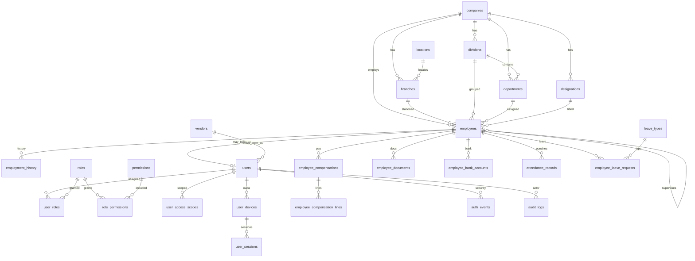

# AryadiBusiness Portal — V2 Database Architecture

**Status:** Greenfield design. Independent of the legacy schema.  
**Engine:** MySQL 8+ / InnoDB / `utf8mb4` / `utf8mb4_unicode_ci`  
**Naming:** `snake_case` for databases, tables, columns, indexes, and constraints.  
**Primary keys:** `BIGINT UNSIGNED AUTO_INCREMENT` named `{entity}_id`.  
**Foreign keys:** `{referenced_entity}_id` (never mix `UserID`, `user_id`, `userid`).

This document is the design review. SQL is generated only after these decisions.

---

## 1. Architecture overview

V2 is an **API-first HR and operations identity platform** for a professional services company. The database is organized as **bounded modules** that share a small set of core identities:

- An **employee** is a person in the company (HR truth).
- A **user** is a login principal (auth truth). A user *may* belong to an employee, a vendor, or neither (bootstrap/system operator).
- A **role** is a named job of the portal. A **permission** is a module/action code (`employee.update`).
- **Org scope** limits *which rows* a permission applies to (company / branch / division / department).
- Money, documents, bank accounts, attendance, leave, tokens, and audit are **never** columns on `employees` or `users`.

The application talks to the database through services/repositories, not through screen-shaped tables. Web, mobile, and admin share the same schema.

**What this V2 foundation includes:** organization, employees, employment history, compensation, documents, bank, authentication, RBAC, access scope, sessions/devices, attendance, leave, vendors, notifications, API clients, configuration, audit.

**What this V2 foundation deliberately excludes (add later without redesign):** CRM/tickets/PPM/quotations, payroll runs/payslips, KPI snapshots, convenience claims. Those modules should FK into `employees`, `users`, `branches`, and `permissions` when added.

---

## 2. Module list

| Code | Module | Tables (logical) |
|---|---|---|
| A | Organization | `companies`, `locations`, `branches`, `divisions`, `departments`, `designations` |
| B | Employee master | `employees`, `employment_history` |
| C | Authentication | `users`, `password_reset_tokens`, `password_history`, `email_verification_tokens` |
| D | Authorization / RBAC | `roles`, `permissions`, `role_permissions`, `user_roles` |
| E | Session and devices | `user_devices`, `user_sessions` |
| F | Documents | `file_assets`, `document_types`, `employee_documents` |
| G | Compensation | `salary_component_types`, `employee_compensations`, `employee_compensation_lines`, `employee_statutory_accounts` |
| — | Bank | `employee_bank_accounts` |
| — | Sensitive identity | `employee_identity_numbers` (encrypted PAN/Aadhaar-class data) |
| H | Attendance | `attendance_geofences`, `employee_geofence_assignments`, `attendance_records` |
| I | Leave | `leave_types`, `holidays`, `employee_leave_balances`, `employee_leave_requests` |
| J | Branch/location | covered by A (`locations`, `branches`) |
| K | Vendors | `vendors` |
| L | Notifications | `notification_templates`, `notifications`, `notification_deliveries`, `user_push_tokens` |
| M | Audit and security | `auth_events`, `audit_logs` |
| N | API clients | `api_clients`, `api_client_keys`, `api_client_permissions` |
| O | System configuration | `system_settings`, `idempotency_keys` |
| — | Access scope | `user_access_scopes` |

One access-scope table is used instead of four near-identical tables. Scope is `company | branch | division | department` plus `scope_id`. That is the same model the four-table sketch described, without duplicating constraints and query logic.

---

## 3. Entity list

**Masters:** Company, Location, Branch, Division, Department, Designation, Role, Permission, Document type, Salary component type, Leave type, Holiday, Vendor, API client, System setting.

**People / principals:** Employee, User, User-role, User-access-scope.

**History:** Employment history, Compensation (dated), Compensation lines.

**Sensitive:** Identity numbers, Bank accounts, Documents (metadata + encrypted number), File assets (object storage pointers).

**Runtime security:** Device, Session, Password reset token, Email verification token, Password history, Auth event.

**Operations:** Attendance geofence, Geofence assignment, Attendance record, Leave balance, Leave request.

**Messaging / integration:** Notification, Delivery, Push token, API key, API client permission, Idempotency key.

**Audit:** Business audit log.

---

## 4. Relationship explanation

```
Company 1──* Branch
Company 1──* Division
Company 1──* Department
Company 1──* Designation
Company 1──* Location (optional owner; locations may also be shared)
Branch *──1 Location (optional)
Division *──0..1 Branch
Department *──1 Division
Department *──0..1 Branch

Employee *──1 Company
Employee *──0..1 Branch / Division / Department / Designation
Employee *──0..1 Employee (supervisor)
Employee 1──* EmploymentHistory
Employee 0..1──1 User          (portal login; optional)
Vendor    0..1──* User          (vendor portal login; optional)
User  *──* Role via user_roles
Role  *──* Permission via role_permissions
User  1──* UserAccessScope
User  1──* UserDevice 1──* UserSession
Employee 1──* Compensation 1──* CompensationLine
Employee 1──* Document / BankAccount / IdentityNumber / AttendanceRecord / LeaveRequest
```

**Foreign-key delete policy (default):** `RESTRICT` / `ON DELETE RESTRICT` for masters and historical rows.  
**SET NULL:** optional links (supervisor, current designation if unassigned, revoked actor on some logs).  
**Never CASCADE-delete** employees, attendance, leave, salary, audit, or sessions because a user/employee row was removed. Deactivate instead.

**Current vs history:** `employees` holds the **current** org assignment for fast listing APIs. `employment_history` is the source of truth for “where did they work, under whom, with what title, and when?”. Updates run in a **transaction**: close the open history row (`effective_to`), insert a new row, update `employees`.

---

## 5. ER diagram (Mermaid)



---

## 6. Table dependency order

1. `companies`, `locations`
2. `branches`, `divisions`, `departments`, `designations`
3. `employees` (self-FK supervisor; audit FKs to `users` added later)
4. `employment_history`
5. `vendors`
6. `users` → then `ALTER` employee/vendor audit FKs
7. `roles`, `permissions`, `role_permissions`, `user_roles`, `user_access_scopes`
8. `user_devices`, `user_sessions`
9. `password_reset_tokens`, `password_history`, `email_verification_tokens`
10. `file_assets`, `document_types`, `employee_documents`, `employee_identity_numbers`, `employee_bank_accounts`
11. `salary_component_types`, `employee_statutory_accounts`, `employee_compensations`, `employee_compensation_lines`
12. `attendance_geofences`, `employee_geofence_assignments`, `attendance_records`
13. `leave_types`, `holidays`, `employee_leave_balances`, `employee_leave_requests`
14. `notification_templates`, `notifications`, `notification_deliveries`, `user_push_tokens`
15. `api_clients`, `api_client_keys`, `api_client_permissions`
16. `auth_events`, `audit_logs`
17. `system_settings`, `idempotency_keys`

This order avoids circular CREATE failures. `employees.created_by` → `users` is applied with `ALTER TABLE` after `users` exists.

---

## 7. Data dictionary (core)

### 7.1 Organization

| Table | Purpose | Soft-status |
|---|---|---|
| `companies` | Internal legal employer (not a client site catalog) | `is_active` |
| `locations` | Physical/geo place: address, lat/long | `is_active` |
| `branches` | Internal office/site under a company | `is_active` |
| `divisions` | Business unit (e.g. Facility Management) | `is_active` |
| `departments` | Function under a division (e.g. HR) | `is_active` |
| `designations` | Job title catalog | `is_active` |

Client corporates and client branches from the legacy ticketing system are **out of this HR foundation**. They must not be forced into `companies`/`branches` used for employees.

### 7.2 Employees

| Table | Contains | Does not contain |
|---|---|---|
| `employees` | Identity, current org FKs, emails, phone, status, profile file id | Salary, bank, Aadhaar/PAN, tokens, leave counts, geofence |
| `employment_history` | Dated org assignment + supervisor + status | Pay |

### 7.3 Auth / RBAC / session

| Table | Notes |
|---|---|
| `users` | `password_hash` only. No JWT, no refresh token, no employee PII beyond FKs |
| `user_sessions` | `refresh_token_hash` CHAR(64). Rotation family id. Never raw token |
| `user_devices` | Stable device identity; sessions hang off devices |
| `roles` / `permissions` | Codes unique. Permissions are `module.action` |
| `user_access_scopes` | Permission × org intersection is enforced in the API |

### 7.4 Sensitive

| Table | Storage |
|---|---|
| `employee_identity_numbers` | Ciphertext + last4 + key version. Never plaintext |
| `employee_bank_accounts` | Account number ciphertext + last4. IFSC plaintext (not secret) |
| `employee_documents` | Object-storage key via `file_assets`. Number ciphertext when needed |
| `file_assets` | Provider, bucket, object key, mime, size, sha256. **No BLOBs** |

---

## 8. Primary keys

Every table: `{entity}_id BIGINT UNSIGNED NOT NULL AUTO_INCREMENT PRIMARY KEY`.

Junction tables still have a surrogate PK (`user_role_id`, `role_permission_id`) **and** a unique pair on the natural key. That keeps APIs, audit FKs, and ORM simple without composite PK pain.

---

## 9. Foreign keys

| Child | Parent | On delete | Why |
|---|---|---|---|
| `branches.company_id` | `companies` | RESTRICT | Do not drop company with branches |
| `employees.company_id` | `companies` | RESTRICT | Preserve employment |
| `employees.supervisor_employee_id` | `employees` | SET NULL | Supervisor can leave |
| `users.employee_id` | `employees` | SET NULL | Login may outlive HR record briefly; prefer disable user |
| `users.vendor_id` | `vendors` | SET NULL | Same |
| `user_roles.user_id` | `users` | CASCADE | Roles are not historical business records |
| `user_sessions.user_id` | `users` | CASCADE | Sessions are ephemeral |
| `attendance_records.employee_id` | `employees` | RESTRICT | History |
| `employee_compensations.employee_id` | `employees` | RESTRICT | History |
| `employee_leave_requests.employee_id` | `employees` | RESTRICT | History |
| `auth_events` / `audit_logs` | `users` | SET NULL | Keep the log if user is later removed |
| `file_assets` refs | — | RESTRICT | Do not orphan storage metadata accidentally |

CASCADE is used only for **ephemeral security bindings** (roles, sessions, push tokens, reset tokens), never for HR/payroll/attendance/audit.

---

## 10. Unique constraints

| Constraint | Protects |
|---|---|
| `companies.code` | Stable API/org code |
| `branches (company_id, code)` | Branch code per company |
| `divisions (company_id, code)` | Division code |
| `departments (company_id, code)` | Department code |
| `designations (company_id, code)` | Title code |
| `employees.employee_number` | HR number |
| `employees.work_email` (nullable unique) | Login/HR email |
| `users.username`, `users.email` | Auth identifiers |
| `roles.code`, `permissions.code` | RBAC codes |
| `user_roles (user_id, role_id)` | No duplicate role grant |
| `role_permissions (role_id, permission_id)` | No duplicate mapping |
| `user_access_scopes (user_id, scope_type, scope_id)` | No duplicate scope |
| `user_sessions.refresh_token_hash` | Token lookup |
| `attendance_records (employee_id, work_date)` | One attendance day |
| `employee_compensations` current flag | One open salary structure |
| `employee_bank_accounts` one primary per employee (generated) | Single primary account |
| `leave_types.code` | Leave API code |
| `employee_leave_balances (employee_id, leave_type_id, balance_year)` | One balance row |
| `vendors.vendor_code` | Vendor identity |
| `api_clients.client_code` | M2M identity |
| `idempotency_keys (actor_type, actor_id, idempotency_key)` | Replay safety |
| `document_types.code` | Document catalog |
| `salary_component_types.code` | Pay component catalog |

---

## 11. Index strategy

Indexes exist only for FKs, uniqueness, and expected query paths. Every extra index slows writes.

| Index | Query it supports |
|---|---|
| All FK columns | JOIN and ON DELETE checks |
| `employees (company_id, employment_status, last_name, first_name)` | Org directory listing |
| `employees (supervisor_employee_id)` | Team roster |
| `employment_history (employee_id, effective_from)` | “Where did they work?” |
| `users (status, last_login_at)` | Admin user ops |
| `user_sessions (user_id, revoked_at, expires_at)` | Active sessions / logout-all |
| `user_sessions (token_family_id)` | Refresh reuse detection |
| `auth_events (user_id, created_at)` | Security timeline |
| `auth_events (event_type, created_at)` | Failed-login monitoring |
| `audit_logs (entity_type, entity_id, created_at)` | Record history |
| `attendance_records (work_date, status)` | Daily attendance board |
| `employee_leave_requests (status, start_date)` | Approval queue |
| `employee_compensations (employee_id, effective_from)` | Salary history |
| `notifications (user_id, is_read, created_at)` | In-app inbox |
| `user_push_tokens (user_id, is_active)` | Fan-out push |
| `employee_documents (employee_id, document_type_id)` | HR file list |

---

## 12. Security strategy

1. **Least privilege DB user:** `SELECT, INSERT, UPDATE, DELETE` only. No `DROP`, `ALTER`, `GRANT`, `FILE`, `SUPER`.
2. **Passwords:** PHP `password_hash($pw, PASSWORD_ARGON2ID)` (fallback `PASSWORD_BCRYPT`). Verify with `password_verify()`. Column is `password_hash VARCHAR(255)`.
3. **Tokens:** Access JWT is **not stored**. Refresh and reset tokens are stored as **SHA-256 hex** (`CHAR(64)`). Compare using `hash_equals`.
4. **JWT signing:** RS256 (or EdDSA). Private key **outside** the repo (KMS/env file with 0600). Claims: `iss`, `aud`, `sub` (user_id), `sid` (session_id), `iat`, `nbf`, `exp`, `jti`. No password, PII, salary, documents, or full employee object.
5. **Encryption at rest (app layer):** AES-256-GCM for identity numbers, bank account numbers, document numbers. Store `ciphertext`, `nonce`, `key_version`. Rotation via `key_version`.
6. **API masking:** Default employee APIs return `XXXX XXXX 1234` / `****1234`. Dedicated “sensitive:read” permissions for full reveal, itself audited.
7. **No secrets in logs:** Passwords, JWTs, refresh tokens, reset tokens, full Aadhaar/PAN/account numbers are forbidden in `auth_events.metadata_json` and `audit_logs`.
8. **Views:** `vw_employees_directory` exposes non-sensitive columns for list endpoints.
9. **Lockout:** `failed_login_attempts` + `locked_until` on `users`.
10. **Critical events** (password reset, disable user, role change): revoke **all** sessions.

---

## 13. Authentication flow

1. Client POST `/auth/login` with username/email + password + device metadata.
2. Load `users` by username or email. If missing, record `LOGIN_FAILED` with `user_id` NULL (do not reveal which).
3. If `status != active` or `locked_until > now()`, fail uniformly.
4. `password_verify`. On failure: increment attempts; if threshold reached, set `locked_until`, emit `ACCOUNT_LOCKED`.
5. On success: reset attempts, set `last_login_at`, upsert `user_devices`, create `user_sessions` with hashed refresh token, emit `LOGIN_SUCCESS`.
6. Return short-lived access JWT + refresh token (raw refresh **only in the response**, never persisted raw).

---

## 14. Authorization flow

Every mutating or sensitive API:

1. Authenticate JWT → `sub` + `sid`. Session must exist, not revoked, not expired.
2. Load union of permissions from `user_roles` → `role_permissions` → `permissions` (cache in Redis/APCu with short TTL).
3. Require permission code (e.g. `employee.update`).
4. If the role is not global (`roles.is_system_wide` or user has scope `company` with `is_all = 1`), evaluate `user_access_scopes` against the target employee’s `company_id` / `branch_id` / `division_id` / `department_id`.
5. Deny if either check fails. Do not leak existence of out-of-scope rows (404 vs 403 policy: prefer 404 for employee fetch).

Example: HR Manager has `employee.update` **and** scope `division = A` → can update employees only where `employees.division_id = A`.

---

## 15. JWT lifecycle

| Token | TTL (default, configurable in `system_settings`) | Stored? |
|---|---|---|
| Access | 15 minutes | No |
| Refresh | 14 days (mobile) / 8 hours (web) | Hash only |

Access token expiry is the only revocation for access JWTs. To kill access immediately, revoke the session and reject `sid` on every request (cheap PK lookup). Rotation: see §16.

---

## 16. Refresh-token lifecycle

1. Client sends refresh token.
2. Hash it; lookup `user_sessions.refresh_token_hash`.
3. If not found: ignore (possible reuse after rotation). Optionally, if `jti`/family was previously valid, **revoke the entire `token_family_id`** (theft).
4. If revoked or expired: deny.
5. **Rotate:** revoke current session row (`revoked_at`, reason `rotated`), insert new session in same `token_family_id`, new hash.
6. Issue new access JWT + new refresh token.
7. Emit `TOKEN_REFRESH`.

Logout current: revoke this session. Logout all: revoke all sessions for `user_id`. Admin revoke device: revoke sessions for `device_id`.

---

## 17. Password-reset lifecycle

1. User requests reset. Always return the same generic success message.
2. If user exists and is active: create `password_reset_tokens` with hash, expiry (e.g. 30 minutes), single-use.
3. Email contains raw token; DB has hash only.
4. Confirm: hash presented token, match unused non-expired row, `password_hash` update **in a transaction** with: insert `password_history`, mark token used, revoke all sessions, reset lockout, emit `PASSWORD_RESET`.
5. Password change (authenticated) is the same minus email token; emit `PASSWORD_CHANGED`; revoke other sessions (keep current optional).

---

## 18. Login / session lifecycle

```
Login → device upsert → session insert → access+refresh
   │
   ├─ API calls → JWT + sid check
   ├─ Refresh → rotate session
   ├─ Logout → revoke session
   ├─ Logout all / password event → revoke all
   └─ Expiry job → sessions with expires_at < now are inert (index), optional cleanup
```

Auth events are append-only. They are never updated or deleted by the app.

---

## 19. Employee lifecycle

1. **Create employee** (transaction): insert `employees` + opening `employment_history` + optional `users` + `user_roles` + optional compensation/statutory/bank/documents.
2. **Org change:** close history, insert history, update current FKs on `employees`.
3. **Exit:** `employment_status = exited`, `date_of_leaving` set, disable linked `users`, revoke sessions.
4. Physical delete is not supported for employees with any transactional child row.

---

## 20. Salary lifecycle

1. New structure: set previous `effective_to` = day before, insert new header + lines. Transaction.
2. Only one open row (`effective_to IS NULL`) per employee (generated unique).
3. Monetary columns: `DECIMAL(12,2)`. Gross/net stored as header totals **and** must match SUM(lines) in the service layer.
4. Statutory numbers live in `employee_statutory_accounts`, not on `employees`.
5. Salary APIs require `salary.view` / `salary.update` and org scope. Audit old/new JSON **without** unrelated PII.

---

## 21. Attendance lifecycle

1. Geofence is configured on `attendance_geofences` and assigned via `employee_geofence_assignments` — **not** on `employees`.
2. Check-in: insert/update `attendance_records` for `(employee_id, work_date)`. Unique constraint blocks a second day-row. If `check_in_at` is already set, application returns conflict (and unique does not allow a second row).
3. Store coordinates as `DECIMAL(10,8)` / `DECIMAL(11,8)`, device, accuracy, geofence result, photos as `file_assets`.
4. Check-out: update same row; reject if already checked out.
5. Approval fields: supervisor then HR. Status CHECK-constrained.
6. Race: `INSERT ...` with unique `(employee_id, work_date)` + transaction. Two parallel check-ins: one wins, one hits duplicate key.

---

## 22. Leave lifecycle

1. Request insert `employee_leave_requests` status `pending`. Unique overlapping ranges are enforced in the service with `SELECT ... FOR UPDATE` on the employee’s pending/approved rows (MySQL cannot express exclusion constraints as well as PostgreSQL). Optional generated date span check: `end_date >= start_date`.
2. Approve: transaction — set status, approver, timestamp, decrement `employee_leave_balances`.
3. Reject: status + reason; no balance change.
4. Cancel (if policy allows): reverse balance if previously approved.
5. Never a VARCHAR “EmployeeLeave” on the employee row.

---

## 23. Audit lifecycle

- **Auth:** every security event → `auth_events` (append-only).
- **Business:** employee/salary/role/leave/attendance approval → `audit_logs` with `old_json` / `new_json` redacted.
- Retention: do not `DELETE`. Archive to cold storage by date partition later if volume requires it (MySQL 8 partitioning can be added on `created_at` without changing the logical model).

---

## Transactions (required)

| Operation | Why |
|---|---|
| Create employee + user + role | Avoid orphan login or employee without role |
| Employment change | History + current row atomic |
| Salary replace | Header + lines + close previous |
| Leave approve | Request + balance |
| Role permission replace | Delete+insert mappings |
| Password reset confirm | Hash + history + session revoke |
| Login session create | Device + session |
| Refresh rotation | Revoke old + insert new |

---

## Concurrency

| Risk | Control |
|---|---|
| Double check-in | Unique `(employee_id, work_date)` |
| Two open salary rows | Generated unique current flag |
| Duplicate role grant | Unique `(user_id, role_id)` |
| Refresh reuse | Family revoke |
| Double leave approve | Row lock + status CHECK + update `WHERE status='pending'` |
| Idempotent mobile retries | `idempotency_keys` |

---

## Bootstrap administrator (no seed password)

1. Deploy schema + seed roles/permissions.
2. Insert company.
3. On the server, run a one-off CLI that:
   - prompts for username/email/password on stdin (not argv)
   - hashes with Argon2id
   - inserts `users` with `status=active`
   - grants `SUPER_ADMIN`
   - records `auth_events` `ACCOUNT_BOOTSTRAP`
4. Delete or disable the CLI in production after first use.
5. Never commit a default password.

---

## Application DB grants (intent)

```sql
-- DBA runs separately; not part of app migrations
CREATE USER 'aryadi_app'@'10.0.0.%' IDENTIFIED BY '<vault-password>';
GRANT SELECT, INSERT, UPDATE, DELETE ON aryadi_business_v2.* TO 'aryadi_app'@'10.0.0.%';
-- Optional read-only reporting user: SELECT only
```

---

## Quality check

| Check | Result |
|---|---|
| Duplicate org names on employees | Fixed: FKs to masters |
| Auth mixed with HR | Split `users` vs `employees` |
| Tokens on users | Moved to hashed sessions |
| Salary/docs/bank on employees | Separate modules |
| Circular CREATE | Broken with ALTER for user audit FKs |
| CASCADE on history | Not used |
| FLOAT money | Not used |
| VARCHAR dates | Not used |
| Sensitive API columns | Views + encryption + masking |
| Race on attendance | Unique constraint |
| Naming | snake_case only |
| Soft-delete everywhere | No; `is_active` / status on masters; history preserved |
| Client companies vs employer | Separated (clients out of this foundation) |

---

## Architecture review — why V2 is better than legacy

Legacy `employees` is a spreadsheet: designation/division/department as text, salary as VARCHAR, bank and Aadhaar on the same row, attendance geofence on the person, leave as an integer, dates as VARCHAR, MyISAM/latin1 in places, no FKs.

Legacy `users` stores MD5-class passwords, `AuthToken` on the user (single device), `UserType` as a string, and `-1` sentinels instead of NULL. `user_tokens` stores **raw JWTs and refresh tokens**. `user_roles` hangs off `EmployeeID` rather than a user principal. `user_divisions` is not a real scope model. Login compares passwords in SQL and has a hardcoded master password in PHP.

V2 gives: typed money and geography, InnoDB FKs, current + historical employment, RBAC + org scope, Argon2id, hashed refresh/reset tokens, RS256 JWT with session binding, device administration, encrypted identity/bank numbers, object-storage documents, attendance uniqueness, leave as a workflow, vendor principals that are not fake employees, M2M API clients, and append-only security/business audit.

That is a foundation for web, mobile, and admin APIs — not a CRUD dump of yesterday’s screens.
